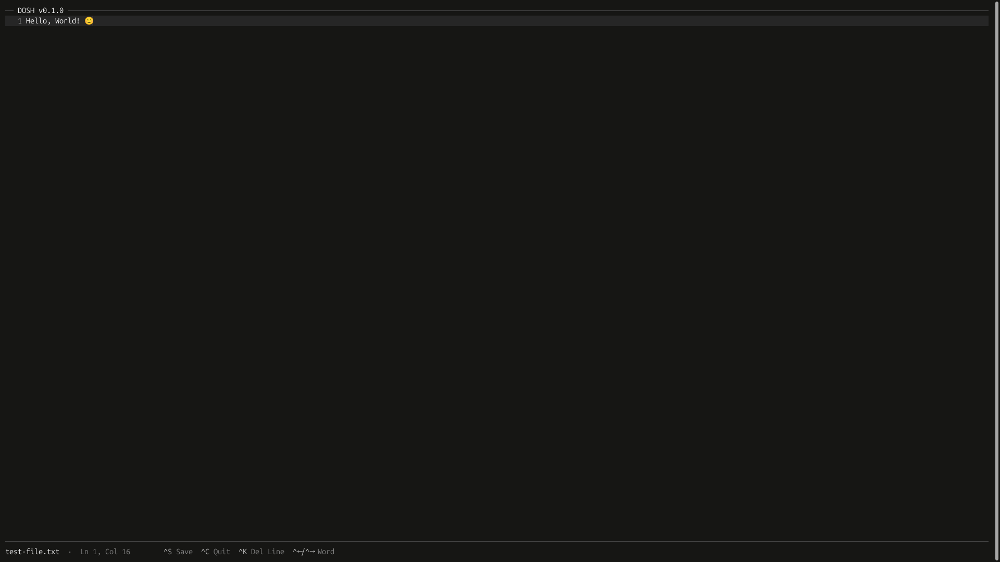

<div align="center">
    <h1>Dosh</h1>
    <p>A lightweight terminal text editor written in Go.</p>
    <p>
        
        
        
        
        
    </p>
</div>

---

## Overview

**Dosh** is a lightweight terminal text editor written in **Go**.

The project focuses on building a simple and efficient editing environment from the ground up, with direct terminal interaction and a minimal dependency footprint.

Dosh currently provides basic text editing capabilities, including character insertion, deletion, line content deletion, cursor movement, word navigation, tab insertion, multiline editing, Unicode text support, terminal resizing, screen scrolling, a status bar, file opening, file saving, new file creation, unsaved changes detection, overwrite confirmation, exit confirmation, and text search.

> [!IMPORTANT]  
> Dosh is under active development and may be unstable or contain bugs. Features are still being implemented and tested, so it is not recommended for editing important files yet.

---

## Table of Contents

- [Showcase](#showcase)
- [Features](#features)
- [Roadmap](#roadmap)
    - [Core Editing](#core-editing)
    - [Terminal](#terminal)
    - [File Management](#file-management)
    - [Editor Features](#editor-features)
    - [Architecture](#architecture)
    - [Future](#future)
- [Project Structure](#project-structure)
- [Requirements](#requirements)
- [Running](#running)
    - [Clone the repository](#clone-the-repository)
    - [Run](#run)
    - [Test](#test)
- [Author](#author)
- [License](#license)

---

## Showcase

<p align="center">
    <em>Dosh running in the terminal</em><br>
    
</p>

---

## Features

- Terminal-based text editing
- Raw keyboard input
- Unicode text support
- Grapheme cluster-aware cursor movement
- Grapheme cluster-aware character deletion
- Character insertion
- Character deletion with Backspace
- Character deletion with Delete
- Backspace line merging
- Delete line merging
- Line content deletion with Ctrl + K
- Tab insertion
- Multiline text editing
- Horizontal cursor movement
- Vertical cursor movement
- Arrow key support
- Home and End navigation
- Word navigation
- Ctrl + Left / Ctrl + Right navigation
- Delete key parsing
- ANSI terminal rendering
- Clean terminal restoration on exit
- Terminal resizing support
- Vertical screen scrolling
- Status bar with cursor position
- File opening
- File saving with Ctrl + S
- New file creation
- Unsaved changes detection
- Overwrite confirmation
- Exit confirmation with unsaved changes
- Save status feedback
- ANSI terminal colors
- Text search with Ctrl + F

---

## Roadmap

### Core Editing

| Feature                    | Status                      |
|:---------------------------|:----------------------------|
| Character insertion        | ████████████████████ `100%` |
| Character deletion         | ████████████████████ `100%` |
| Tab insertion              | ████████████████████ `100%` |
| Multiline editing          | ████████████████████ `100%` |
| Horizontal cursor movement | ████████████████████ `100%` |
| Vertical cursor movement   | ████████████████████ `100%` |
| Backspace line merging     | ████████████████████ `100%` |
| Delete character           | ████████████████████ `100%` |
| Delete line merging        | ████████████████████ `100%` |
| Home and End navigation    | ████████████████████ `100%` |
| Word navigation            | ████████████████████ `100%` |
| Line content deletion      | ████████████████████ `100%` |
| Unicode text support       | ████████████████████ `100%` |

### Terminal

| Feature                 | Status                      |
|:------------------------|:----------------------------|
| Raw keyboard input      | ████████████████████ `100%` |
| ANSI terminal rendering | ████████████████████ `100%` |
| Cursor positioning      | ████████████████████ `100%` |
| Terminal restoration    | ████████████████████ `100%` |
| Terminal resizing       | ████████████████████ `100%` |
| Screen scrolling        | ████████████████████ `100%` |
| Status bar              | ████████████████████ `100%` |

### File Management

| Feature                   | Status                      |
|:--------------------------|:----------------------------|
| Open files                | ████████████████████ `100%` |
| Save files                | ████████████████████ `100%` |
| Create new files          | ████████████████████ `100%` |
| Unsaved changes detection | ████████████████████ `100%` |
| Save As                   | ░░░░░░░░░░░░░░░░░░░░ `0%`   |

### Editor Features

| Feature                  | Status                      |
|:-------------------------|:----------------------------|
| Search                   | ████████████████████ `100%` |
| Replace                  | ░░░░░░░░░░░░░░░░░░░░ `0%`   |
| Copy and paste           | ░░░░░░░░░░░░░░░░░░░░ `0%`   |
| Undo and redo            | ░░░░░░░░░░░░░░░░░░░░ `0%`   |
| Multiple file support    | ░░░░░░░░░░░░░░░░░░░░ `0%`   |
| Line numbers             | ░░░░░░░░░░░░░░░░░░░░ `0%`   |
| Configurable indentation | ░░░░░░░░░░░░░░░░░░░░ `0%`   |

### Architecture

| Feature                   | Status                      |
|:--------------------------|:----------------------------|
| Editor module             | ████████████████████ `100%` |
| Input module              | ████████████████████ `100%` |
| Terminal module           | ████████████████████ `100%` |
| File module               | ████████████████████ `100%` |
| Rendering abstraction     | ░░░░░░░░░░░░░░░░░░░░ `0%`   |
| Input command abstraction | ░░░░░░░░░░░░░░░░░░░░ `0%`   |
| Automated tests           | ░░░░░░░░░░░░░░░░░░░░ `0%`   |

### Future

| Feature                         | Status                    |
|:--------------------------------|:--------------------------|
| Syntax highlighting             | ░░░░░░░░░░░░░░░░░░░░ `0%` |
| Configuration file              | ░░░░░░░░░░░░░░░░░░░░ `0%` |
| Themes                          | ░░░░░░░░░░░░░░░░░░░░ `0%` |
| Plugin system                   | ░░░░░░░░░░░░░░░░░░░░ `0%` |
| Cross-platform terminal support | ░░░░░░░░░░░░░░░░░░░░ `0%` |

---

## Project Structure

```text
dosh/
├── cmd/
│   └── dosh/
│       └── main.go
├── internal/
│   ├── editor/
│   │   ├── editor.go
│   │   ├── grapheme.go
│   │   └── line.go
│   ├── file/
│   │   └── file.go
│   ├── input/
│   │   ├── input.go
│   │   ├── key.go
│   │   └── parser.go
│   └── terminal/
│       ├── colors.go
│       └── screen.go
├── .gitignore
├── go.mod
├── go.sum
├── LICENSE
└── README.md
```

---

## Requirements

- Go 1.25.0 or later
- Linux Terminal

---

## Running

### Clone the repository

```bash
git clone https://github.com/avieira-dev/dosh.git
cd dosh
```

### Run

To start Dosh without opening a file:

```bash
go run ./cmd/dosh
```

To open an existing file:

```bash
go run ./cmd/dosh path/to/file.txt
```

### Test

To verify that the project builds successfully:

```bash
go test ./...
```

> [!NOTE]  
> Automated tests are still planned and will be added as the project evolves.

---

## Author

**Alexandre Vieira**  
GitHub: [@avieira-dev](https://github.com/avieira-dev)

---

## License

Distributed under the [MIT License](LICENSE). See `LICENSE` for details.